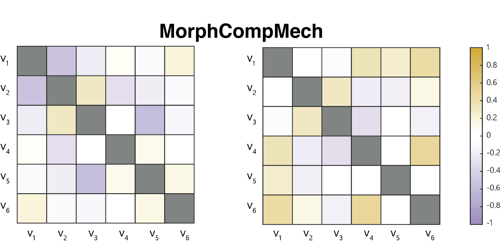

 <h1 align="center">MorphCompMech: Correlation Analysis for Hair Morphology, Composition, and Mechanics</h1>

<p align="center">
  <a href="https://is.mpg.de/person/ballardini"><strong>Giulia Ballardini</strong></a> ·
  <a href="https://hi.is.mpg.de/person/aschulz"><strong>Andrew K. Schulz</strong></a>
</p>

 
 <p align="center">
  
</p>


<p align="center">
  
</p>

Repository for quantitative analysis of hair morphology, composition, and mechanics.

## Overview
This repository provides a reproducible workflow for the quantitative analysis of morphological, compositional, and mechanical properties of cat (*Felis catus*) hair, including whiskers, untreated body hair, and chemically treated body hair.

The implementation supports the statistical analyses described in the associated manuscript, including generalized linear models (GLMs), non-parametric bootstrap resampling, correlation analysis, and stepwise regression with bootstrap inclusion frequency (BIF).

💡 Tip: You can switch between [light and dark modes](https://github.com/settings/appearance) in your GitHub profile settings for better readability. This repo is designed to be viewed in light mode.

## Data

Related datasets (indentation, TEM, SEM, and chemical composition) are available via the Edmond data repository (link provided upon publication).

This repository additionally includes synthetic datasets for reproducibility and testing of the full analysis pipeline without requiring access to unpublished experimental data.

This repository includes:
- MATLAB scripts for exploring relationships among morphological, compositional, and mechanical parameters using bootstrap methods adapted from those of [Bala et al., 2011](https://www.sciencedirect.com/science/article/pii/S1751616111001196?casa_token=Wa4RIFd3AEQAAAAA:CsA3YNd1EJQKpA7qC8L3wAs4vqLc5vrTMEiSm2WxRmY1VI6cZdz-bQvbUyiXcXCAk8CRyCcCh5Y).
- Python–SPSS integrated scripts for automated general linear model (GLM) repeated measures analyses.

The full implementation details are described in the associated paper (the link will be available upon paper acceptance). 

## Software requirements
- [SPSS](https://www.ibm.com/docs/en/spss-statistics/cd?topic=overview-download-installation-instructions) v29.0 (IBM, USA) with Python integration for GLM analyses.
    - Required Python libraries (typically preinstalled with SPSS):
        `spss` - SPSS Python integration
        `tkinter` - GUI dialogs
        `os` - File path management
- [MATLAB](https://de.mathworks.com/help/install/ug/install-products-with-internet-connection.html) version R2024b (MathWorks, USA) for regression, correlations, and curve fitting.

## Variable description  

<small><small>

| Variable Names | Description | Units | Type of property |
|----------|--------------|--------------|--------------|
| Thickness | Cuticule wall thickness | µm | Morphological |
| IF |  The amount of keratin intermediate filaments (IFs) in the hair cortex  | Area percent | Compositional |
| Null | The amount of porous hollow regions in the hair cortex | Area percent | Compositional |
| CEG | The amount of calcium-enriched granules (CEGs) in the hair cortex | Area percent | Compositional |
| Ca:S | The ratio of the amount of calcium compared to the amount of sulfur in different individual CEGs | Unitless | Compositional |
| E | Modulus of elasticity | GPa | Mechanical |
| Hc | Hardness | GPa | Mechanical |

</small></small>

Note: This repository uses "CEG" as a variable name for CEG prevelence in the cortex of hair cross sections. In the associated paper, CEG stands for calcium-enriched granules. 

## MATLAB Analysis Pipeline
Analyses quantify relationships among morphological, compositional, and mechanical variables across hair type (body hair, whisker) and location (base, tip).

### Workflow
- Dataset selection — User interactively selects one of the `.mat` datasets.
- Normality testing — Shapiro–Wilk tests are applied to each metric.
- Bootstrap correlation analysis — Pearson correlation coefficients are computed across 5,000 bootstrap resamples (sampling with replacement). Final correlation values are defined as the median of the bootstrap distribution.
- Visualization — Correlation matrices are visualized as heatmaps.
- Stepwise regression — Bidirectional stepwise linear regression is performed within each bootstrap iteration.
- Predictor stability — Predictor importance is quantified using bootstrap inclusion frequency (BIF), defined as the proportion of bootstrap iterations in which a predictor is retained.

### Statistical framework
- Non-parametric bootstrap resampling (B = 5,000, sampling with replacement).
- Correlation coefficients reported as median bootstrap estimates.
- Two-tailed p-values derived from bootstrap distributions.
- Effect sizes interpreted using standard |r| thresholds.
- Regression coefficients reported as median bootstrap estimates with 95% percentile confidence intervals.

### Usage
1. Open MATLAB.
2. Navigate to the repository directory.
3. Run the main script: `Analysis_Bootstrap_Correlation_StepwiseRegression.m`.
4. Select a `.mat` dataset when prompted.

The `.mat` file should contain the following variables:

<small><small>

| Variable | Description |
|-----------|--------------|
| `metrics` | Cell array containing the matrices. |
| `names`   | Internal variable names corresponding to each metric (see Table above). |
| `labels`  | Labels to be displayed in the plots and tables. |

### Included Datasets
This repository includes synthetic example files to allow testing of the plotting and analysis workflow without access to unpublished experimental data.

</small></small>

## Python-SPSS Analysis  
Analyses evaluate differences across hair type, location, depth, and extraction time depending on experimental design.

### Workflow
- Data selection — Excel file `.xlsx` is loaded via file dialog. 
- Sheet selection — Enter names of sheets for analysis.
- Automated GLM analysis — Repeated-measures or factorial GLMs are executed per sheet.
- Output generation — Results exported as `.spv` (SPSS Viewer) and `.pdf` files in a selected folder.

### Statistical framework
- General linear models estimated in SPSS v29.0.
- Estimated marginal means used for interaction effects.
- Fisher's least significant difference (LSD) applied for pairwise comparisons.
- Sphericity tested using Mauchly’s test (when applicable).
- Greenhouse–Geisser correction applied when sphericity is violated.

### Usage
1. Open SPSS
2. Open the `{...}_Analysis.sps`. 
3. Run the script (press `Ctrl + A`, then `Ctrl + R`).
4. Select input Excel file with the data to analyze `{...}_Data.xlsx`.
5. Select output directory.
6. Enter the sheet names as they appear in the Excel file (comma-separated).
7. Review exported results (the file will be named after the sheet name).

### Factor Description and Included Dataset 

<small><small>

| Variable | Description | Values of variable |
|----------|--------------|--------------|
| Depth | Indentation contact depth (nm) | 50, 100, 200, 400, 700 |
| HairType | Domestic cat hair type | body hair, whisker |
| Position | Position along the hair length | base, tip |
| Time | Shindai extraction time (h) | 0, 72, 120 |
	
| Dataset | Description | Analysis |
|----------|--------------|--------------|
| Morphological_Position_SampleData.xlsx | Morphological (thickness) and compositional (CEG, Ca:S) variables of untreated body hair and whiskers. | Difference between hair type and position. |
| Mechanical_Depth_SampleData.xlsx | Mechanical variables (E, Hc) from indentation of untreated body hair and whiskers. | Difference between position and depth. |
| Mineral_Time_SampleData.xlsx | Compositional variables (CEG, Ca:S) of treated hair after Shindai extraction. | Difference between position and time. |
| Mechanical_Time_SampleData.xlsx | Mechanical variables (E, Hc) from indentation of treated hair after Shindai extraction. | Difference between position, time, and depth. |

</small></small>

## Support
Feel free to contact us if you need support. Our names and contact information are listed at the bottom of this page.

## Contributing
Please suggest improvements or report issues.

## Notes
If you encounter any problems or questions about specific parts of the codebase, don't hesitate to raise an issue. Always provide as much context as possible.

 > 
> 
```bibtex
@misc{ballardini_MorphCompMech_2026,
	title = {Correlation Analysis for Hair Morphology, Composition, and Mechanics},
	author = {Ballardini, Giulia and Schulz, Andrew K.},
	year = {2026},
	howpublished = {GitHub repository},
	url = {https://github.com/GiuliaBallardini/MorphCompMech},
	note = {Manuscript in preparation}
}

```


## Licence
This project is licensed under the GNU GPL version 3 - see the [LICENSE](https://github.com/GiuliaBallardini/MorphCompMech/blob/main/LICENSE) file for details.

## Copyright

© 2026, Max Planck Society 

Authors: Giulia Ballardini, Andrew K. Schulz

## Acknowledgements
The authors thank J. Burns and [J.-C. Passy](https://github.com/jcpassy) for their assistance in preparing the content for this GitHub. The authors thank N. Rokhmanova for her [ARIADNE repo](https://github.com/nrokh/ARIADNE) inspiring this ReadMe. Thanks to [Katherine J. Kuchenbecker](https://is.mpg.de/~kjk) for support and feedback.

## Contact
This code repository was implemented by [Giulia Ballardini](https://github.com/GiuliaBallardini) and [Andrew K. Schulz](https://github.com/Aschulz94).
